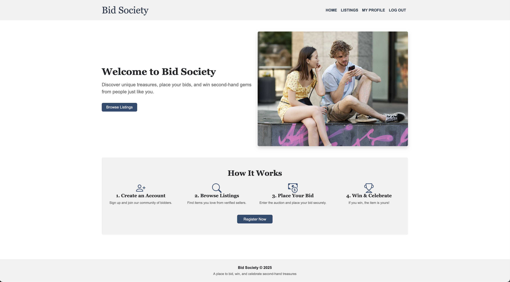

## Semester Project 2

## _Bid Society_



## 📚 Description

This is my delivery for **Semester Project 2** at Noroff. The task was to apply the skills acquired over the past semesters to build an **auction website** using the [Noroff API V2](https://docs.noroff.dev/docs/v2).

The project adheres to the technical constraints approved by the company's CTO and implements the following user stories:

1. A user with a `stud.noroff.no` email may register
2. A registered user may login
3. A registered user may logout
4. A registered user may update their avatar
5. A registered user may view their total credit
6. A registered user may view bids made on a listing
7. A registered user may create a listing with a title, deadline, media, and description
8. A registered user may bid on another user's listing
9. An unregistered user may search listings

---

## 🌐 API

This project uses the [Noroff API V2](https://docs.noroff.dev/docs/v2) for all user and auction-related functionality.

---

## 🚀 Visit the Site

**Coming soon...**

---

## 🤝 Contribution

If you'd like to contribute, feel free to fork the repo and follow the steps under _Getting Started_.

---

## 🛠️ Getting Started

Before you begin, make sure you have the following installed:

- [Node.js](https://nodejs.org/)
- A terminal (e.g. Terminal, iTerm2, Git Bash, etc.)

### Clone the Repository

```bash
git clone git@github.com:VildeAvloes/semester-project-2.git

```

### Navigate to project folder

```
cd semester-project-2
```

Install dependencies

```
npm install
```

## Usage

When installed you can use the following commands to run the application

**Start:** Launches the page in web browser and watch for changes in the scss

```
npm run start
```

**Build:** Compiles the SCSS to CSS

```
npm run build
```

**Format:** Formats files using Prettier

```
npm run format
```

**Lint:** Lints files using ESLint

```
npm run lint
```

## 🧰 Technologies Used

- Node.js
- Sass
- Prettier
- Eslint
- Live Server

## 📄 License

This project is open for educational use as part of Noroff's Semester Project 2. Please contact me before reusing the code for anything outside of that.

## Contact

[My GitHub Profile](https://github.com/VildeAvloes)
[My LinkedIn Page](https://www.linkedin.com/in/vilde-avloes/).
